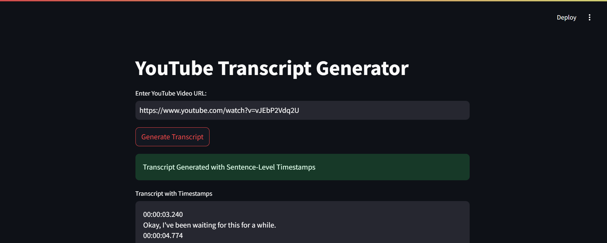

# YouTube Transcript Generator

A simple web application that allows you to generate transcripts with timestamps from YouTube videos. This project uses `yt-dlp` for downloading audio from YouTube videos and `AssemblyAI` for transcription services. The app is built with Python and Streamlit, and is containerized using Docker.

## Features

- **Download Audio**: Extracts audio from a given YouTube video URL.
- **Transcription with Timestamps**: Generates transcripts with sentence-level timestamps using AssemblyAI's transcription service.
- **Streamlit Interface**: A simple and interactive UI for users to input the YouTube video URL and retrieve the transcript.

## Prerequisites

- Docker
- AssemblyAI API Key

## Installation

1. **Clone the repository**:
    ```bash
    git clone https://github.com/xpertanaltics/youtubeTranscript.git
    cd youtubeTranscript
    ```

2. **Set up your AssemblyAI API Key**:
   - Replace the placeholder API key in the `app.py` file with your actual AssemblyAI API key:
     ```python
     aai.settings.api_key = "your_assemblyai_api_key"
     ```

3. **Build the Docker image**:
    ```bash
    docker build -t app.py .
    ```

4. **Run the Docker container**:
    ```bash
    docker run -p 8501:8501 app.py
    ```

5. **Access the app**:
    - Open your web browser and navigate to `http://localhost:8501`.

## Usage

1. **Input the YouTube URL**: Paste the URL of the YouTube video you want to transcribe.
2. **Generate Transcript**: Click on the "Generate Transcript" button to start the process. The app will download the audio, upload it to AssemblyAI, and display the transcript with timestamps.
3. **View Transcript**: The transcript will be displayed in the text area on the page, with each sentence marked with its respective timestamp.

## Example



## Troubleshooting

- **FFmpeg Not Found Error**: Ensure that FFmpeg is installed and accessible. If you're running the app in Docker, the provided Dockerfile handles this installation.
- **Slow Docker Build**: If the Docker build process is slow, consider using pre-built images with `ffmpeg` or optimizing the Dockerfile as per the instructions provided in this README.
