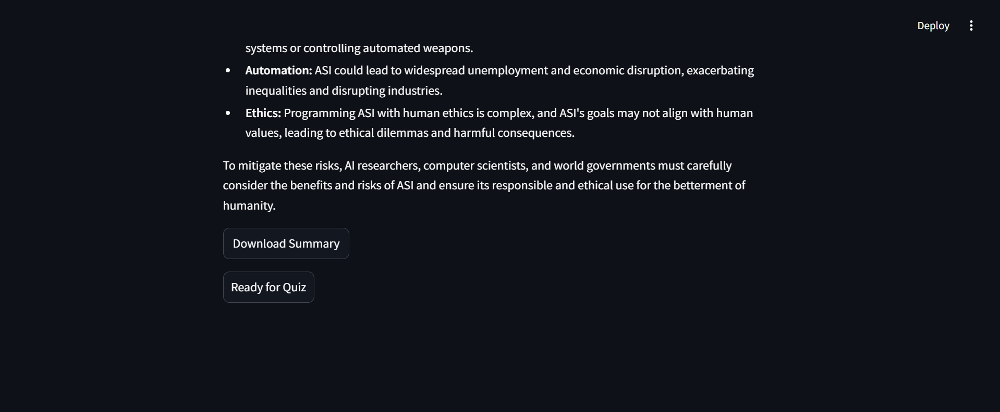

# YouTube Video Summarizer and Quiz Generator

This Streamlit application generates summaries for YouTube videos and creates multiple-choice quizzes based on those summaries. It uses YouTube transcripts and AI to generate meaningful quizzes for testing your knowledge on the video content.

## Features

- **YouTube Video Summarization**: Automatically extracts the transcript of a YouTube video and summarizes it using AI.
- **Quiz Generation**: Generates multiple-choice questions based on the summarized content, allowing users to test their comprehension.
- **Real-time Interaction**: Users can answer the quiz in real-time, navigate between questions, and receive feedback on their answers.
- **PDF Export**: Download quiz results and feedback as a PDF.

## Technologies Used

- **Streamlit**: Frontend interface for generating the web app.
- **YouTube Transcript API**: Fetches transcripts from YouTube videos.
- **Generative AI (Gemini API)**: Provides AI-powered summarization and quiz generation.
- **FPDF**: Generates PDFs for quiz results.

## Installation

### Requirements

- Python 3.7+
- Streamlit
- YouTube Transcript API
- google.generativeai (for Gemini API)
- FPDF (for PDF generation)
- Docker

### Setup

1. **Clone the repository**:
    ```bash
    git clone https://github.com/xpertanaltics/youtubeTranscript.git
    cd youtubeTranscript
    ```

2. **Set up your Google - Gemini API Key**:
   - Replace the placeholder API key in the `.env` file with your actual GEMINI API key:
     ```python
     GEMINI_API_KEY= = "your_gemini_api_key"
     ```

3. **Build the Docker image**:
    ```bash
    docker build -t app.py .
    ```

4. **Run the Docker container**:
    ```bash
    docker run -p 8501:8501 app.py
    ```

5. **Access the app**:
    - Open your web browser and navigate to `http://localhost:8501`.

## How to Use

1. **YouTube Video Summarization**:
   - Enter a valid YouTube video URL in the input box.
   - The application will extract the transcript and generate a summary using AI.
   - You can download the summary as a `.txt` file.

2. **Quiz Generation**:
   - After the summary is generated, click on "Ready for Quiz".
   - The application will generate a quiz with multiple-choice questions based on the summary.
   - Navigate between questions using the "Previous" and "Next" buttons, and select answers from the available options.

3. **Quiz Submission**:
   - After completing the quiz, click "Submit Answers" to view your score and feedback for each question.
   - You can also download a PDF containing your results and feedback.

## Example

### 1. Summarization Page:




### 2. Quiz Page:


### 3. Quiz Results Page:


## API Reference

- **YouTube Transcript API**: Used to extract transcripts from YouTube videos.
- **Gemini API**: Used for summarization and quiz generation.
  - Learn more about [Gemini API](https://developers.google.com/)

## Future Improvements

- Implementing additional quiz formats (True/False, fill-in-the-blank).
- Allowing users to select the number of questions generated for the quiz.
- Enhancing the UI/UX design for better navigation.

## Contributing

Contributions are welcome! Please feel free to open issues or submit pull requests if you have any suggestions for improvements.
